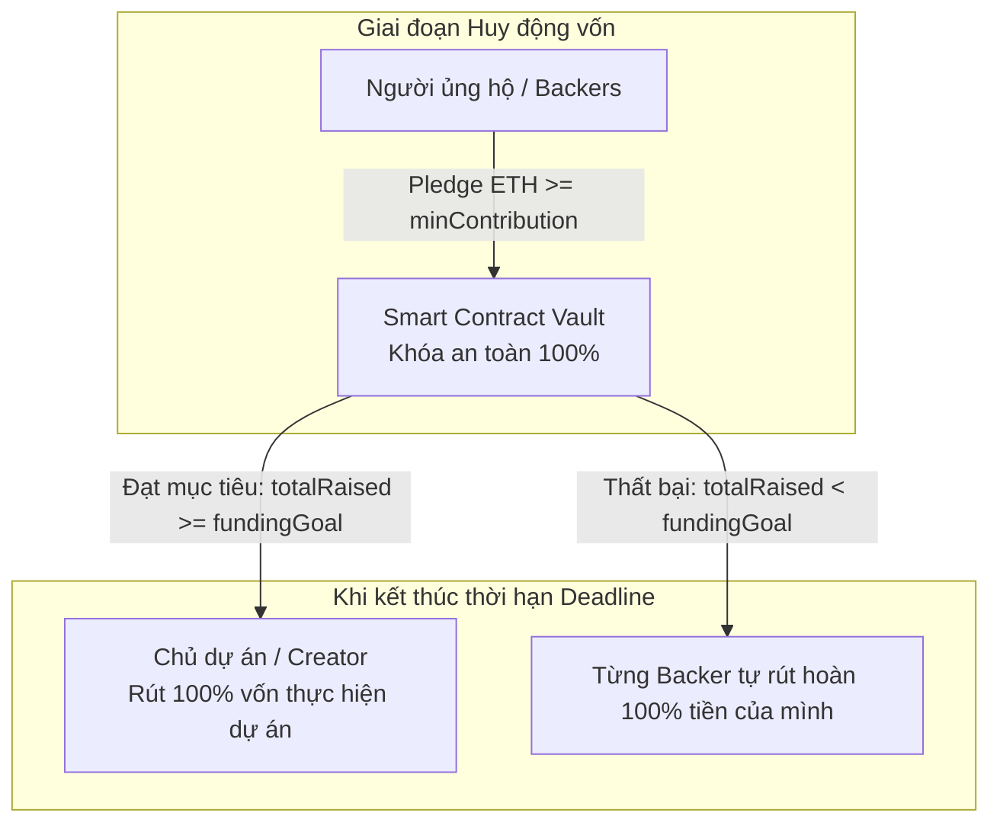

# ECONOMIC RULES — Quy tắc Kinh tế & Cơ chế Bảo vệ Vốn (v0.1)

**Dự án:** HCE Student Crowdfund (Nền tảng Gây quỹ Dự án Sinh viên có Hoàn tiền)  
**Tác giả:** Nhóm K57 Kinh Tế Số — Khoa HTTTKT, Trường Đại học Kinh tế, Đại học Huế  
**Quy ước áp dụng:** `AGENTS.md` (Solidity ^0.8.20, CEI pattern, Custom errors, Basis points: 1% = 100 bps)

---

## 1. Dòng tiền và Quyền lợi kinh tế (Cash Flow & Incentives)



### 1.1. Dòng tiền vào (Capital Inflow)
- **Nguồn vốn:** Vốn đóng góp tự nguyện từ cộng đồng sinh viên, giảng viên, cựu sinh viên và các đối tác tài trợ của Trường Đại học Kinh tế - Đại học Huế.
- **Phương thức nhận vốn:** Người đóng góp chuyển trực tiếp đồng tiền gốc của mạng (`ETH`) vào hợp đồng thông qua hàm nghiệp vụ `pledge()`. Toàn bộ số tiền được hợp đồng lưu giữ trực tiếp trong số dư của chính nó (`address(this).balance`).
- **Phân bổ giá trị:** 100% số tiền người ủng hộ gửi vào được ghi nhận chính xác cho địa chỉ ví đó thông qua bảng ánh xạ `contributions[msg.sender]`. Không có bất kỳ khoản phí ẩn hoặc chiết khấu trung gian nào trong quá trình nạp.

### 1.2. Dòng tiền ra (Capital Outflow)
- **Kịch bản 1: Chiến dịch thành công (`totalRaised >= fundingGoal`):**
  - Toàn bộ tổng số tiền huy động được (`totalRaised`) được giải ngân trọn vẹn một lần duy nhất về địa chỉ ví của chủ dự án (`creator`).
  - **Chính sách phí nền tảng (Platform Fee):** Đối với các dự án nghiên cứu khoa học và khởi nghiệp sinh viên HCE, nền tảng áp dụng mức phí **0% (0 basis points)** để tối đa hóa nguồn lực cho sinh viên. (Các phiên bản thương mại sau này có thể cấu hình tối đa 1% = 100 bps để trích lập Quỹ Khuyến học HCE).
- **Kịch bản 2: Chiến dịch thất bại (`totalRaised < fundingGoal`):**
  - Hợp đồng kích hoạt trạng thái cho phép hoàn tiền.
  - Từng người ủng hộ chủ động gọi hàm `claimRefund()` để nhận lại chính xác **100% số tiền đã góp**, không bị giữ lại bất kỳ khoản phí phạt nào.

---

## 2. Giới hạn chống lạm dụng & Bảo vệ người dùng (Limits & Anti-Abuse)

Để ngăn chặn các hành vi phá hoại kinh tế, rửa tiền, đầu cơ hoặc làm suy kiệt tài nguyên lưu trữ blockchain, hệ thống áp dụng 4 tầng rào cản kỹ thuật:

| Rào cản kiểm soát | Giá trị tham số | Căn cứ kinh tế / Kỹ thuật | Cơ chế cưỡng chế trên Blockchain |
| :--- | :---: | :--- | :--- |
| **Mức đóng góp tối thiểu (`minContribution`)** | **$0.001 \text{ ETH}$** ($\approx 2,5 \text{ USD} \approx 65.000 \text{ VNĐ}$) | Chống bão bụi giao dịch (Dust Attack) spam hàng triệu giao dịch 1 wei làm phình to bộ nhớ trạng thái (`mapping state storage`) của hợp đồng. | Hợp đồng kiểm tra `if (msg.value < minContribution) revert ContributionTooLow(...)`. |
| **Trần đóng góp tối đa mỗi ví (`maxContributionPerWallet`)** | **$25\%$** tổng mục tiêu gọi vốn | Chống nguy cơ một nhà tài trợ cá mập (Whale) thâu tóm chiến dịch, hoặc tự nạp tiền giả mạo rồi rút tiền để thao túng quyền biểu quyết. | Kiểm tra `contributions[msg.sender] + msg.value <= maxContributionPerWallet`. |
| **Thời hạn chiến dịch hợp lệ (`duration`)** | **$3 \text{ ngày} \le \text{Duration} \le 30 \text{ ngày}$** | Tránh việc chủ dự án đặt thời hạn quá dài (ví dụ: 10 năm) nhằm mục đích "giam vốn" của người ủng hộ vĩnh viễn. | Ràng buộc trực tiếp trong hàm khởi tạo constructor. |
| **Trần huy động tối đa (Overfunding Cap)** | **$120\%$** của `fundingGoal` | Cho phép biên độ dôi dư tài chính nhỏ để phòng ngừa biến động giá ETH, nhưng ngăn chặn việc thổi phồng quy mô dự án vượt quá năng lực quản lý của sinh viên. | Khi tổng góp đạt $120\%$, hợp đồng tự động đóng cổng nhận tiền mới. |

---

## 3. Quyền quản trị và Phân cấp quyền hạn (Governance & Access Control)

Nguyên tắc tối thượng của HCE Student Crowdfund là **"Code is Law" và Không giữ chìa khóa vạn năng (No God Mode)**:

| Chủ thể | Quyền hạn được phép thực hiện | Những điều TUYỆT ĐỐI BỊ CẤM / HỢP ĐỒNG TỪ CHỐI |
| :--- | :--- | :--- |
| **Chủ dự án (Creator)** | 1. Khởi tạo thông tin chiến dịch, mục tiêu và thời hạn chót.<br>2. Rút toàn bộ tiền quỹ KHI VÀ CHỈ KHI thời gian đã hết và chiến dịch đạt hoặc vượt mục tiêu. | 1. **CẤM** rút tiền trước thời điểm `deadline`.<br>2. **CẤM** rút tiền khi chưa gom đủ `fundingGoal`.<br>3. **CẤM** sửa đổi mục tiêu tiền hoặc kéo dài thời hạn sau khi đã có người ủng hộ góp vốn. |
| **Người ủng hộ (Backer)** | 1. Đóng góp ETH trong phạm vi hạn mức quy định.<br>2. Toàn quyền gọi `claimRefund()` để lấy lại 100% tiền khi chiến dịch thất bại.<br>3. Kiểm tra số dư đóng góp minh bạch bất kỳ lúc nào qua hàm view. | 1. **CẤM** tự ý hủy đóng góp và rút tiền trước hạn khi chiến dịch đang mở (nhằm bảo đảm tính cam kết cho mục tiêu gọi vốn chung). |
| **Quản trị viên hệ thống (Admin)** | 1. Gắn nhãn chứng nhận sinh viên chính quy HCE (Student Verification Badge) ngoài đời thực.<br>2. Tạm dừng khẩn cấp (Emergency Pause) nếu phát hiện bằng chứng dự án gian lận nghiêm trọng. | 1. **TUYỆT ĐỐI CẤM** can thiệp hoặc chuyển tiền từ hợp đồng về ví cá nhân của Admin.<br>2. Nếu hợp đồng bị Pause, chế độ an toàn duy nhất được kích hoạt là **MỞ KHÓA HOÀN TIỀN CHO BACKERS**. |

---

## 4. Tình huống người dùng bị thiệt và Phân tích rủi ro (Loss Scenarios & Edge Cases)

Theo chuẩn kiểm toán tài chính Web3, mọi điểm bất lợi tiềm tàng cho người dùng đều phải được công khai minh bạch:

### 4.1. Rủi ro chi phí gas mạng khi hoàn tiền (The Gas Fee Asymmetry)
- **Tình huống:** Khi chiến dịch thất bại, người ủng hộ được hoàn 100% số tiền đã góp. Tuy nhiên, người ủng hộ vẫn phải tự trả một khoản phí gas nhỏ cho mạng blockchain để thực thi giao dịch rút tiền (`claimRefund`).
- **Mức độ thiệt hại:** Nếu trên Ethereum L1, phí gas có thể tốn từ 2 - 5 USD. Nếu sinh viên chỉ ủng hộ 5 USD thì tiền phí gas chiếm tỷ trọng rất lớn.
- **Biện pháp giảm thiểu:** Khuyến nghị và định hướng triển khai hợp đồng trên các mạng **Layer 2 (như Base hoặc Arbitrum)**. Trên L2, phí gas cho hàm hoàn tiền chỉ tốn khoảng $0,005 - $0,01 USD (tương đương 100 - 300 VNĐ), hoàn toàn không đáng kể so với quyền lợi hoàn vốn của sinh viên.

### 4.2. Rủi ro trượt giá tài sản mã hóa (Crypto Volatility Risk)
- **Tình huống:** Trong thời gian 30 ngày diễn ra chiến dịch, giá trị quy đổi của đồng ETH so với VNĐ/USD có thể biến động giảm (ví dụ: ETH giảm 20%). Khi nhận lại tiền hoàn, lượng ETH vẫn nguyên vẹn nhưng sức mua bằng tiền pháp định giảm.
- **Biện pháp giảm thiểu:** Công bố rõ rủi ro thị trường cho toàn bộ người tham gia; thiết lập thời hạn chiến dịch ngắn (khuyến nghị 7 - 14 ngày cho các dự án quy mô sinh viên).

### 4.3. Rủi ro không thực hiện cam kết sau khi rút vốn (Post-funding Execution Risk)
- **Tình huống:** Chủ dự án đạt đủ 100% mục tiêu, rút tiền thành công nhưng sau đó lười biếng hoặc không hoàn thành sản phẩm thực tế như đã hứa.
- **Biện pháp giảm thiểu:** Đây là bài toán tín nhiệm ngoài đời thực (Off-chain trust). Nhóm giải quyết bằng 2 tầng phòng vệ:
  - Tầng 1: Quy định định danh sinh viên (bắt buộc xác thực thẻ sinh viên và khoa chủ quản trước khi được cấp quyền deploy chiến dịch).
  - Tầng 2: Đề xuất lộ trình nâng cấp ở Lab 11 & Lab 15 với cơ chế **Giải ngân theo từng chặng (Milestone Escrow)**: Vốn chỉ được mở khóa 30% cho đợt 1, phần còn lại cần sự biểu quyết đồng thuận của cộng đồng người ủng hộ.

---

## 5. Phản biện Mô hình Kinh tế & Trả lời của Nhóm (Adversarial Critique & Resolutions)

Thực hiện phiên phản biện độc lập theo mẫu câu lệnh chuẩn `I.6` (Phản biện mô hình kinh tế) của học phần ECO2432:

> *"Bạn là người dùng thận trọng. Chỉ dựa trên SPEC và ECONOMIC_RULES, hãy nêu 5 cách một người có thể lạm dụng quy tắc hoặc làm người khác bị thiệt. Với mỗi cách, chỉ rõ quy tắc nào chưa đủ chặt."*

### ⚠️ Phản biện 1: Chiến thuật "Tự nạp rút trộm" (Self-pledge Rug Pull Attack)
- **Cách thức lạm dụng:** Kẻ lừa đảo tạo một dự án sinh viên hấp dẫn với mục tiêu $1 \text{ ETH}$. Cộng đồng đóng góp được $0.8 \text{ ETH}$. Nhận thấy sắp hết hạn, kẻ lừa đảo dùng các ví phụ của chính mình nạp thêm $0.2 \text{ ETH}$ để đẩy tổng tiền đạt ngưỡng $1.0 \text{ ETH}$. Ngay sau khi hết hạn, hắn kích hoạt `claimFunds()` và rút trọn vẹn $1 \text{ ETH}$ (chiếm đoạt thành công $0.8 \text{ ETH}$ của người khác và cuỗm mất).
- **Quy tắc chưa đủ chặt ban đầu:** Chưa có cơ chế xác minh danh tính chủ dự án và cho phép nạp tiền ẩn danh không giới hạn số lượng ví phụ.
- **Giải pháp của nhóm:** 
  1. Hợp đồng giữ nguyên tắc cơ chế kinh tế: Kẻ lừa đảo đã phải đánh cược $0.2 \text{ ETH}$ tiền thật của chính mình.
  2. Ở tầng ứng dụng Web3 HCE, bổ sung quy chế định danh ví của Creator thông qua xác thực email trường (`@hce.edu.vn`). Nếu có dấu hiệu lừa đảo, thông tin danh tính sinh viên sẽ được chuyển cho Hội đồng Kỷ luật nhà trường xử lý nghiêm minh theo pháp luật.

### ⚠️ Phản biện 2: Chiến thuật "Giam vốn người khác" bằng thời hạn vô lý (Capital Lock Hostage)
- **Cách thức lạm dụng:** Kẻ xấu khởi tạo hợp đồng và đặt thời gian chiến dịch `duration` lên tới 10 năm (hoặc 3.000 ngày). Những người ủng hộ vô tình nạp tiền vào sẽ không thể nào rút lại tiền trong suốt 10 năm đó vì điều kiện `block.timestamp >= deadline` không bao giờ thỏa mãn trong ngắn hạn.
- **Quy tắc chưa đủ chặt ban đầu:** Để ngỏ cho người tạo dự án tự do truyền bất kỳ tham số thời gian nào vào hàm khởi tạo.
- **Giải pháp của nhóm:** Đã khóa cứng giới hạn trong `ProjectCore.sol`:
  ```solidity
  if (durationSeconds < 3 days || durationSeconds > 30 days) revert InvalidDuration();
  ```
  Bảo đảm tối đa 30 ngày là người ủng hộ chắc chắn được quyền rút lại tiền nếu dự án không đạt mục tiêu.

### ⚠️ Phản biện 3: Chiến thuật "Bão bụi giao dịch" làm tràn bộ nhớ (State Bloat Dust Spam)
- **Cách thức lạm dụng:** Kẻ tấn công viết một tập lệnh (script) gửi hàng chục nghìn giao dịch với số tiền cực nhỏ $1 \text{ wei}$ từ hàng nghìn ví khác nhau vào hợp đồng. Nếu hợp đồng sử dụng vòng lặp duyệt qua danh sách người ủng hộ để hoàn tiền tự động, vòng lặp sẽ bị vượt quá hạn mức gas của block (Block Gas Limit) dẫn tới hợp đồng bị tê liệt vĩnh viễn (Denial of Service - DoS).
- **Quy tắc chưa đủ chặt ban đầu:** Hợp đồng không quy định mức đóng góp sàn và có nguy cơ dùng mô hình "Push Payment" (tự động đẩy tiền cho mọi người).
- **Giải pháp của nhóm:**
  1. Quy định mức đóng góp tối thiểu: `minContribution = 0.001 ETH`. Giao dịch dưới mức này bị hủy ngay tại cổng.
  2. Áp dụng chuẩn thiết kế **Pull over Push (Rút chủ động thay vì Đẩy thụ động)**: Hợp đồng KHÔNG bao giờ dùng vòng lặp để chuyển tiền cho toàn bộ người dùng. Mỗi người ủng hộ tự chịu trách nhiệm gọi hàm `claimRefund()` cho riêng mình, triệt tiêu hoàn toàn nguy cơ nghẽn gas toàn cục!

### ⚠️ Phản biện 4: Chủ dự án bỏ quên hợp đồng khiến tiền kẹt vĩnh viễn (Abandonment Deadlock)
- **Cách thức lạm dụng:** Chiến dịch thất bại nhưng chủ dự án sau khi thấy không đủ tiền thì bỏ mặc, không tương tác với hợp đồng, không bấm nút kết thúc hay kích hoạt bất kỳ trạng thái nào. Nếu hệ thống bắt buộc chủ dự án phải bấm nút "Hủy chiến dịch" thì backers mới được rút tiền, thì số tiền ủng hộ sẽ bị kẹt vĩnh viễn.
- **Quy tắc chưa đủ chặt ban đầu:** Phụ thuộc vào hành động chủ quan của Creator để chuyển trạng thái chiến dịch.
- **Giải pháp của nhóm:** Thiết kế trạng thái động dựa trên đồng hồ khối (`block.timestamp`): Hàm `claimRefund()` kiểm tra trực tiếp điều kiện:
  ```solidity
  if (block.timestamp < deadline) revert CampaignStillActive();
  if (totalRaised >= fundingGoal) revert CampaignSucceeded();
  ```
  Người ủng hộ có quyền rút tiền ngay tức khắc sau giây phút hết hạn mà **hoàn toàn KHÔNG CẦN sự cho phép hay phê duyệt nào từ phía Creator**.

### ⚠️ Phản biện 5: Tấn công Rút tiền đệ quy (Reentrancy Attack trên hàm `claimRefund`)
- **Cách thức lạm dụng:** Kẻ tấn công tạo một hợp đồng độc hại có hàm fallback `receive()`. Hắn đóng góp $0.1 \text{ ETH}$ vào chiến dịch. Khi chiến dịch thất bại, hắn gọi `claimRefund()`. Trong quá trình nhận ETH, hàm `receive()` của kẻ tấn công tiếp tục gọi lại `claimRefund()` liên tục trước khi hợp đồng kịp trừ số dư `contributions[msg.sender]`, dẫn tới rút cạn toàn bộ quỹ bảo chứng của chiến dịch.
- **Quy tắc chưa đủ chặt ban đầu:** Nếu lập trình viên đảo thứ tự lệnh, chuyển ETH ra ngoài trước khi trừ số dư ghi sổ.
- **Giải pháp của nhóm:** 
  1. Tuân thủ tuyệt đối quy tắc bắt buộc của `AGENTS.md`: Áp dụng mẫu **Checks - Effects - Interactions**.
  2. Cập nhật số dư về 0 trước khi chuyển tiền:
     ```solidity
     uint256 refundAmount = contributions[msg.sender];
     contributions[msg.sender] = 0; // Effects TRƯỚC
     (bool ok, ) = payable(msg.sender).call{value: refundAmount}(""); // Interactions SAU
     require(ok, "Transfer failed");
     ```
  3. Bổ sung `ReentrancyGuard` của OpenZeppelin v5 để tạo hai lớp khóa an toàn tuyệt đối.
