# PRESENTATION PLAN — Kịch bản Báo cáo & Demo Sản phẩm (5 Phút)

**Dự án:** HCE Student Crowdfund (Nền tảng Gây quỹ Dự án Sinh viên có Hoàn tiền)  
**Nhóm sinh viên:** K57 Kinh Tế Số — Trường Đại học Kinh tế, Đại học Huế  
**Thời lượng:** Đúng 5 phút (300 giây) · Không dùng slide thuyết trình lý thuyết · Mở và tương tác trực tiếp trên các artifact của repository.

---

## 1. Phân vai và Kịch bản chi tiết từng giây (5-Minute Script)

```mermaid
gantt
    title KỊCH BẢN THUYẾT TRÌNH TRỰC TIẾP (5 PHÚT)
    dateFormat  X
    axisFormat %s"s"
    section Kịch bản
    1. Người dùng & Vấn đề (Hoàng Mạnh Tường)      :0, 30
    2. Quy tắc Kinh tế & Bảo chứng (Nguyễn Nguyên Phương):30, 75
    3. Demo Luồng Cốt lõi Thành công (Hoàng Mạnh Tường) :75, 165
    4. Demo Ca Gian lận Bị Chặn (Nguyễn Nguyên Phương):165, 210
    5. An toàn & Lộ trình Tiếp theo (Cả 2 thành viên) :210, 300
```

| Mốc thời gian | Nội dung trình bày | Người phụ trách | Artifact & Bằng chứng thực tế phải mở trên màn hình |
| :---: | :--- | :---: | :--- |
| **0:00 – 0:30** *(30 giây)* | **Người dùng và Bài toán thực tế:** - Giới thiệu tên sản phẩm và câu khẩu hiệu một câu. - Nêu nỗi đau thực tế của sinh viên HCE: Gây quỹ qua tài khoản cá nhân hay bị mất tiền khi dự án hủy ngang, người ủng hộ mất niềm tin. | **Hoàng Mạnh Tường** *(Nhóm trưởng / BA)* | Mở trực tiếp file [`README.md`](file:///c:/Users/Tuong/Downloads/hce-web3-starter/hce-web3-starter/README.md) và chỉ vào phần *Thông tin dự án & Mục tiêu cốt lõi*. |
| **0:30 – 1:15** *(45 giây)* | **Quy tắc Kinh tế & Quyền lợi Bảo chứng:** - Giải thích cơ chế bảo chứng "All-or-Nothing". - 4 quy tắc rào cản: Mức sàn `0.001 ETH`, trần $25\%$, thời hạn 3–30 ngày, và cơ chế hoàn tiền 100% tự động nếu không đạt mục tiêu trước hạn chót. | **Nguyễn Nguyên Phương** *(Smart Contract / Dev)* | Mở [`docs/SPEC.md`](file:///c:/Users/Tuong/Downloads/hce-web3-starter/hce-web3-starter/docs/SPEC.md) và [`docs/ECONOMIC_RULES.md`](file:///c:/Users/Tuong/Downloads/hce-web3-starter/hce-web3-starter/docs/ECONOMIC_RULES.md), chỉ vào sơ đồ dòng tiền và bảng 4 rào cản chống lạm dụng. |
| **1:15 – 2:45** *(90 giây)* | **Demo Trực tiếp Luồng Cốt lõi (Live Action):** - Kết nối ví MetaMask trên mạng thử nghiệm Sepolia. - Sinh viên A đóng góp $0.05 \text{ ETH}$ vào chiến dịch. - Hiển thị thanh tiến độ nhảy trực tiếp trên giao diện DApp. - Khi đạt mục tiêu: Creator kích hoạt `claimFunds()` rút tiền thành công về ví thực hiện dự án. | **Hoàng Mạnh Tường** *(Contract & Frontend Lead)* | Mở URL Web3 DApp công khai (GitHub Pages) và giao diện MetaMask; sau đó mở Etherscan Sepolia chỉ mã giao dịch (`TxHash`). |
| **2:45 – 3:30** *(45 giây)* | **Demo Ca Vi phạm & Tấn công Bị Chặn:** - Thử nghiệm tài khoản lạ cố tình rút tiền $\rightarrow$ bị chặn với lỗi `OnlyCreatorAllowed()`. - Thử nghiệm đòi hoàn tiền khi dự án đã thành công $\rightarrow$ bị từ chối với lỗi `CampaignSucceeded()`. - Thử nghiệm nạp tiền dưới mức tối thiểu $\rightarrow$ bị hủy giao dịch. | **Nguyễn Nguyên Phương** *(Security / QA Lead)* | Mở console trình duyệt và tệp kiểm thử trong thư mục `test/` hoặc nhật ký lỗi trong `evidence/`. |
| **3:30 – 4:15** *(45 giây)* | **Kết quả Audit & Quyết định An toàn:** - Trình bày lỗi nguy hiểm đã phát hiện (lỗi Push vs Pull, lỗi Reentrancy). - Chứng minh cấu trúc Checks-Effects-Interactions đã triệt tiêu hoàn toàn lỗ hổng mất tiền. | **Cả 2 thành viên** | Mở [`docs/AI_JOURNAL.md`](file:///c:/Users/Tuong/Downloads/hce-web3-starter/hce-web3-starter/docs/AI_JOURNAL.md) và chỉ vào đoạn so sánh giữa mã AI sinh ra và cách nhóm đã sửa. |
| **4:15 – 5:00** *(45 giây)* | **Giới hạn, Bài học và Hướng phát triển:** - Giới hạn: Rủi ro biến động giá ETH và giám sát nghiệm thu đời thực sau khi giải ngân. - Hướng nâng cấp: Cơ chế giải ngân theo mốc (Milestone Escrow) và triển khai trên Layer 2 Base để tối ưu phí gas. | **Cả 2 thành viên** | Mở [`docs/PRESENTATION_PLAN.md`](file:///c:/Users/Tuong/Downloads/hce-web3-starter/hce-web3-starter/docs/PRESENTATION_PLAN.md) kết bài và trả lời câu hỏi vấn đáp của Hội đồng. |

---

## 2. Tiêu chuẩn Kỹ thuật khi Trình diễn
- **Quy tắc không dùng slide:** Không chiếu PowerPoint/Canva. Toàn bộ buổi demo được trình chiếu trực tiếp từ kho GitHub của nhóm, giao diện Web3 DApp thực và trình duyệt Etherscan.
- **Dự phòng rủi ro mạng (Fall-back Strategy):** Luôn chuẩn bị sẵn tài khoản MetaMask đã nạp sẵn Sepolia ETH và một phiên bản chạy trên môi trường Remix VM cục bộ trong trường hợp mạng Sepolia công cộng bị nghẽn bất thường.
