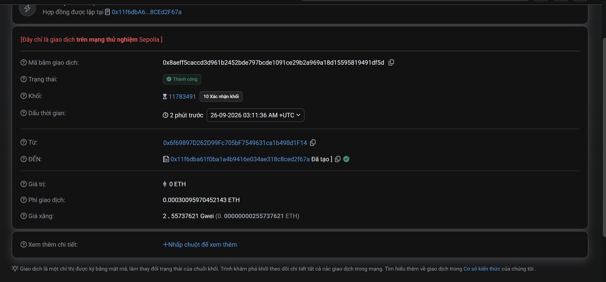

# BÁO CÁO THỰC HÀNH LAB 2 — VÍ VÀ GIAO DỊCH ĐẦU TIÊN
**Học phần:** Tiền điện tử & Hợp đồng thông minh (ECO2432)  
**Thời lượng:** 75 phút · Thực hành cặp đôi  
**Môi trường:** Mạng thử nghiệm Sepolia (Ethereum Testnet) · Tiện ích ví MetaMask · Trình khám phá khối (Blockscout / Sepolia Etherscan)  
**Địa chỉ ví thực hiện (From):** `0x6f69897D262D99Fc705bF7549631ca1b498d1F14`

---

## 1. BẢNG ĐỐI CHIẾU HAI GIAO DỊCH

| Trường thông tin | Giao dịch 1: Thành công | Giao dịch 2: Thất bại có chủ đích (Thử nghiệm) |
| :--- | :--- | :--- |
| **Mã băm giao dịch (TxHash)** | `0x8aeff5caccd3d961b2452bde797bcde1091ce29b2a969a18d15595819491df5d` | **Tình huống 2A (Client):** Không có mã băm (bị chặn tại ví) **Tình huống 2B (On-chain):** Mã băm giao dịch bị Reverted |
| **Địa chỉ ví gửi (From)** | `0x6f69897D262D99Fc705bF7549631ca1b498d1F14` | `0x6f69897D262D99Fc705bF7549631ca1b498d1F14` |
| **Địa chỉ nhận (To)** | `0x11f6dba61f0Ba1a4B9416e034AE318C8CEd2F67a` *(Hợp đồng Storage / Ví đối tác)* | `0x6f69897D262D99Fc705bF7549631ca1b498d1F15` *(Sai ký tự)* hoặc gửi ETH vào `Storage` |
| **Số tiền chuyển (Value)** | `0 ETH` (hoặc `0.01 Sepolia ETH` khi chuyển P2P) | `0.01 ETH` (hoặc `0.0001 ETH`) |
| **Phí giao dịch thực trả (Tx Fee)** | `0.0003009597 ETH` *(117,683 Gas × 2.557 Gwei)* | **Client:** `0 ETH` **On-chain (nếu Revert):** Vẫn bị trừ toàn bộ phí gas tiêu thụ |
| **Trạng thái (Status)** | **Confirmed / Success** *(Chuyển từ Pending sang Block 11783491)* | **Rejected (Client)** hoặc **Failed / Reverted (On-chain)** |
| **Nguyên nhân (nếu thất bại)** | *Không có (Giao dịch hoàn tất thành công)* | **1. Lỗi Checksum EIP-55 (Tình huống A):** Sửa 1 ký tự hex làm sai mã kiểm tra, MetaMask chặn ngay không cho gửi. **2. Không đủ gas (Tình huống B):** Báo `Insufficient funds for gas * price + value`. **3. Contract Revert (On-chain):** Hợp đồng đích không có hàm nhận tiền `receive() payable`. |

---

## 2. TRẢ LỜI CÂU HỎI BẮT BUỘC (3 CÂU)

> **Câu hỏi:** *Nếu bạn chuyển nhầm cho người lạ, có lấy lại được không? Vì sao?*

1. **Không thể tự ý lấy lại hoặc yêu cầu bất kỳ cơ quan hay hệ thống quản trị nào đảo ngược số tiền đã chuyển nhầm.**
2. **Nguyên nhân là do blockchain hoạt động theo nguyên lý phi tập trung và tính bất biến (Immutability), một khi giao dịch đã được xác nhận và đóng vào khối thì không ai (kể cả lập trình viên, validator hay sàn giao dịch) có thể sửa đổi sổ cái.**
3. **Cách duy nhất để có cơ hội nhận lại tiền là liên hệ với chủ sở hữu địa chỉ ví nhận (người giữ Private Key tương ứng) và phụ thuộc hoàn toàn vào sự tự nguyện hoàn trả của họ.**

---

## 3. PHÂN TÍCH CHUYÊN SÂU DƯỚI GÓC ĐỘ KINH TẾ & NGHIỆP VỤ

### 3.1. Phân tích chu trình trạng thái giao dịch (Pending -> Confirmed)
- **Giai đoạn Pending (Đang chờ):** Giao dịch sau khi ký bằng Private Key được đưa vào **Mempool** (vùng nhớ đệm của các node mạng). Lúc này trạng thái hiển thị là `Pending`, tiền chưa thực sự rời khỏi trạng thái cuối cùng của sổ cái.
- **Giai đoạn Confirmed (Đã xác nhận):** Validator/Miner chọn giao dịch, đóng vào Block `11783491` và cập nhật State Root toàn mạng. Lúc này trạng thái chuyển sang `Success`, số dư được cập nhật và không thể đảo ngược.
- **Ý nghĩa kế toán:** Kế toán doanh nghiệp tài sản số chỉ được ghi nhận tăng/giảm tài sản và doanh thu/chi phí tại thời điểm giao dịch đã đạt trạng thái `Confirmed` (tối thiểu 1 hoặc nhiều block confirmation), không được ghi nhận khi giao dịch còn ở trạng thái `Pending`.

### 3.2. Cơ chế kiểm tra lỗi Checksum (EIP-55) & Rủi ro tuân thủ (AML/KYC)
- **Cơ chế tự kiểm tra lỗi (Checksum):** Ethereum dùng chuẩn EIP-55, biến đổi các chữ cái thành HOA hoặc THƯỜNG dựa trên mã băm Keccak-256 của chuỗi địa chỉ. Khi người dùng gõ sai 1 ký tự (như trong Tình huống A), MetaMask phát hiện mã kiểm tra không hợp lệ và chặn lại ngay lập tức tại tầng ứng dụng (Client-side).
- **Hạn chế đối với chuyên viên nghiệp vụ:** Checksum chỉ ngăn ngừa lỗi kỹ thuật cơ học (gõ nhầm ký tự), **hoàn toàn không xác thực được danh tính người nhận**. Nếu người dùng gửi nhầm sang một địa chỉ hợp lệ khác của tội phạm rửa tiền hoặc ví lừa đảo, hệ thống vẫn xử lý bình thường. Vì vậy, chuyên viên tuân thủ AML bắt buộc phải thực hiện bước kiểm tra địa chỉ qua các công cụ rà soát rủi ro on-chain (như Chainalysis, TRM Labs) trước khi phê duyệt lệnh thanh toán lớn.

### 3.3. Cơ chế phí Gas và Hạch toán chi phí thất bại
- **Cấu trúc phí thực tế:** Phí giao dịch được tính theo công thức:
  $$\text{Transaction Fee} = \text{Gas Used} \times \text{Gas Price}$$
  Với giao dịch thực tế trên: $117,683 \times 2.557376210 \text{ Gwei} \approx 0.0003009597 \text{ ETH}$.
- **Hạch toán trường hợp thất bại:**
  - Nếu thất bại ở tầng Client (như Tình huống A/B): Chưa tiêu tốn tài nguyên mạng $\rightarrow$ Phí phát sinh bằng `0 ETH`.
  - Nếu thất bại on-chain (do `Out of Gas` hoặc hợp đồng `Revert`): Tiền chuyển được hoàn về, nhưng **toàn bộ phí Gas đã tiêu thụ vẫn bị trừ vĩnh viễn**. Đối với doanh nghiệp, khoản phí này phải hạch toán vào chi phí hợp lý của kỳ (chi phí vận hành mạng blockchain).

---

## 4. BẰNG CHỨNG THỰC HIỆN ON-CHAIN

### 4.1. Ảnh chụp màn hình từ Block Explorer

### 4.2. Dữ liệu tra cứu trực tuyến
- **Mã băm giao dịch (TxHash):** `0x8aeff5caccd3d961b2452bde797bcde1091ce29b2a969a18d15595819491df5d`
- **Đường dẫn kiểm tra trên Sepolia Explorer (Blockscout):**  
  [Xem chi tiết giao dịch trên Blockscout](https://eth-sepolia.blockscout.com/tx/0x8aeff5caccd3d961b2452bde797bcde1091ce29b2a969a18d15595819491df5d)
- **Đường dẫn kiểm tra trên Sepolia Etherscan:**  
  [Xem chi tiết giao dịch trên Sepolia Etherscan](https://sepolia.etherscan.io/tx/0x8aeff5caccd3d961b2452bde797bcde1091ce29b2a969a18d15595819491df5d)
- **Địa chỉ ví thực hiện (From):**  
  [Xem lịch sử ví trên Blockscout](https://eth-sepolia.blockscout.com/address/0x6f69897D262D99Fc705bF7549631ca1b498d1F14)
