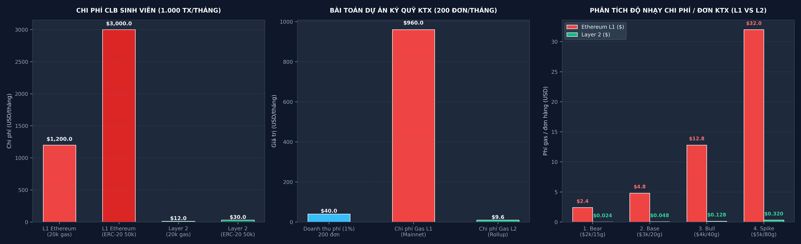

# LAB 7 — TÍNH CHI PHÍ VẬN HÀNH THỰC TẾ
**Học phần:** Tiền điện tử & Hợp đồng thông minh (ECO2432)  
**Thời lượng:** 75 phút · Thực hành nhóm 2 người  
**Sản phẩm nộp:** `lab07.md` gồm **3 Bảng tính chi phí & độ nhạy** và **Đoạn kết luận chuyên sâu về tính khả thi**.

---

## PHẦN 1: BẢNG TÍNH CHI PHÍ VẬN HÀNH THỰC TẾ (CALCULATION SPREADSHEET)

### 1. Bảng tính 1: Mô hình Thẻ tích điểm CLB sinh viên (1.000 lượt cộng điểm/tháng)
*Tham số đầu vào chuẩn:* Đơn giá gas L1 = $20 \text{ Gwei}$, Giá ETH = $\$3.000 \text{ USD}$, Tỷ giá = $25.400 \text{ VNĐ/USD}$, Mạng Layer 2 rẻ hơn $100$ lần (Đơn giá gas L2 hiệu dụng = $0,2 \text{ Gwei}$).

| Chỉ tiêu tính toán | Ký hiệu / Công thức | Phương án A: Ghi biến Storage (~20.000 gas) | | Phương án B: Mint Token ERC-20 (~50.000 gas) | |
| :--- | :---: | :---: | :---: | :---: | :---: |
| | | **Ethereum L1** | **Layer 2 (100x rẻ hơn)** | **Ethereum L1** | **Layer 2 (100x rẻ hơn)** |
| **Lượng gas tiêu thụ / giao dịch** | $G$ | $20.000 \text{ gas}$ | $20.000 \text{ gas}$ | $50.000 \text{ gas}$ | $50.000 \text{ gas}$ |
| **Đơn giá gas** | $P$ | $20,0 \text{ Gwei}$ | $0,2 \text{ Gwei}$ | $20,0 \text{ Gwei}$ | $0,2 \text{ Gwei}$ |
| **Phí 1 giao dịch (ETH)** | $F_{\text{ETH}} = G \times P \times 10^{-9}$ | **$0,000400 \text{ ETH}$** | **$0,000004 \text{ ETH}$** | **$0,001000 \text{ ETH}$** | **$0,000010 \text{ ETH}$** |
| **Phí 1 giao dịch (USD)** | $F_{\text{USD}} = F_{\text{ETH}} \times 3.000$ | **$1,2000 \text{ USD}$** | **$0,0120 \text{ USD}$** | **$3,0000 \text{ USD}$** | **$0,0300 \text{ USD}$** |
| **Phí 1 giao dịch (VNĐ)** | $F_{\text{VNĐ}} = F_{\text{USD}} \times 25.400$ | **$30.480 \text{ VNĐ}$** | **$305 \text{ VNĐ}$** | **$76.200 \text{ VNĐ}$** | **$762 \text{ VNĐ}$** |
| **Số lượng giao dịch / tháng** | $N$ | $1.000 \text{ tx}$ | $1.000 \text{ tx}$ | $1.000 \text{ tx}$ | $1.000 \text{ tx}$ |
| **Tổng chi phí 1 tháng (ETH)** | $\text{Total}_{\text{ETH}} = F_{\text{ETH}} \times N$ | **$0,4000 \text{ ETH}$** | **$0,0040 \text{ ETH}$** | **$1,0000 \text{ ETH}$** | **$0,0100 \text{ ETH}$** |
| **Tổng chi phí 1 tháng (USD)** | $\text{Total}_{\text{USD}} = F_{\text{USD}} \times N$ | **$1.200,00 \text{ USD}$** | **$12,00 \text{ USD}$** | **$3.000,00 \text{ USD}$** | **$30,00 \text{ USD}$** |
| **Tổng chi phí 1 tháng (VNĐ)** | $\text{Total}_{\text{VNĐ}} = \text{Total}_{\text{USD}} \times 25.400$ | **$30.480.000 \text{ VNĐ}$** | **$304.800 \text{ VNĐ}$** | **$76.200.000 \text{ VNĐ}$** | **$762.000 \text{ VNĐ}$** |

---

### 2. Bảng tính 2: Mở rộng cho dự án nhóm — Ký quỹ mua bán đồ cũ KTX (200 đơn hàng/tháng)
*Mô tả luồng giao dịch:* Mỗi đơn hàng gồm 2 giao dịch on-chain: Người mua nạp cọc (`fund`: $45.000 \text{ gas}$) + Người mua xác nhận nhận đồ để giải ngân (`confirmReceived`: $35.000 \text{ gas}$) $\rightarrow$ Tổng $80.000 \text{ gas/đơn}$.  
*Giá trị đơn hàng trung bình:* $500.000 \text{ VNĐ}$ ($\approx \$20 \text{ USD}$). Phí nền tảng bảo chứng thu $1\% = 100 \text{ bps}$ theo quy ước `AGENTS.md`.

| Chỉ tiêu kinh tế | Công thức tính toán | Ethereum L1 Mainnet | Layer 2 (Arbitrum / Base) | Chênh lệch / Hiệu quả |
| :--- | :---: | :---: | :---: | :---: |
| **Số lượng đơn hàng / tháng** | $M$ | $200 \text{ đơn}$ | $200 \text{ đơn}$ | — |
| **Tổng số giao dịch on-chain** | $2 \times M$ | $400 \text{ tx}$ | $400 \text{ tx}$ | — |
| **Tổng lượng gas tiêu thụ / tháng** | $400 \times 40.000$ | $16.000.000 \text{ gas}$ | $16.000.000 \text{ gas}$ | — |
| **Chi phí gas cho mỗi đơn hàng** | $80.000 \times P \times 10^{-9} \times 3.000$ | **$4,80 \text{ USD}$** ($121.920$ VNĐ) | **$0,048 \text{ USD}$** ($1.219$ VNĐ) | L2 rẻ hơn $100$ lần |
| **Tổng chi phí gas vận hành / tháng** | $\text{Chi phí/đơn} \times 200$ | **$960,00 \text{ USD}$** ($24.384.000$ VNĐ) | **$9,60 \text{ USD}$** ($243.840$ VNĐ) | Tiết kiệm $24,1$ triệu/tháng |
| **Doanh thu phí dịch vụ (1%)** | $200 \text{ đơn} \times \$20 \times 1\%$ | **$40,00 \text{ USD}$** ($1.016.000$ VNĐ) | **$40,00 \text{ USD}$** ($1.016.000$ VNĐ) | Nguồn thu ổn định |
| **Lợi nhuận ròng hàng tháng (sau trừ Gas)** | $\text{Doanh thu} - \text{Chi phí Gas}$ | **$-\$920,00 \text{ USD}$** ($-23.368.000$ VNĐ) | **$+\$30,40 \text{ USD}$** ($+772.160$ VNĐ) | **L1 lỗ nặng / L2 có lãi** |

---

### 3. Bảng tính 3: Phân tích độ nhạy & Kiểm thử áp lực thị trường (Sensitivity Analysis & Stress Test)
*Mục tiêu nghiệp vụ:* Đánh giá khả năng sinh tồn tài chính của mô hình Ký quỹ KTX (200 đơn/tháng, 80.000 gas/đơn, doanh thu cố định $\$40,00 \text{ USD/tháng}$) trước 4 kịch bản biến động kết hợp giữa Giá ETH ($\$2.000 \rightarrow \$5.000 \text{ USD}$) và Đơn giá Gas L1 ($15 \rightarrow 80 \text{ Gwei}$).

| Kịch bản thị trường | Giá ETH (USD) | Gas L1 (Gwei) | Gas L2 (Gwei) | Phí gas 1 đơn KTX (L1) | Phí gas 1 đơn KTX (L2) | Tổng chi phí gas tháng L1 | Tổng chi phí gas tháng L2 | Lợi nhuận ròng L1 (Tháng) | Lợi nhuận ròng L2 (Tháng) | Đánh giá khả năng sinh tồn |
| :--- | :---: | :---: | :---: | :---: | :---: | :---: | :---: | :---: | :---: | :--- |
| **1. Thị trường trầm lắng (Bear Market)** | $\$2.000$ | $15,0$ | $0,15$ | **$\$2,40$** ($60.960$ đ) | **$\$0,0240$** ($610$ đ) | **$\$480,00$** ($12,2$ tr) | **$\$4,80$** ($122$ k) | **$-\$440,00$** (Lỗ nặng) | **$+\$35,20$** ($+894$ k) | **L1: Phá sản<br>L2: Sống khỏe (Biên LN 88%)** |
| **2. Kịch bản cơ sở (Base Case)** | $\$3.000$ | $20,0$ | $0,20$ | **$\$4,80$** ($121.920$ đ) | **$\$0,0480$** ($1.219$ đ) | **$\$960,00$** ($24,4$ tr) | **$\$9,60$** ($244$ k) | **$-\$920,00$** (Lỗ nặng) | **$+\$30,40$** ($+772$ k) | **L1: Phá sản<br>L2: Ổn định (Biên LN 76%)** |
| **3. Thị trường tăng trưởng (Bull Market)** | $\$4.000$ | $40,0$ | $0,40$ | **$\$12,80$** ($325.120$ đ) | **$\$0,1280$** ($3.251$ đ) | **$\$2.560,00$** ($65,0$ tr) | **$\$25,60$** ($650$ k) | **$-\$2.520,00$** (Vỡ nợ) | **$+\$14,40$** ($+366$ k) | **L1: Sụp đổ<br>L2: Có lãi (Biên LN 36%)** |
| **4. Mạng nghẽn cực độ (Extreme Gas Spike)** | $\$5.000$ | $80,0$ | $0,80$ | **$\$32,00$** ($812.800$ đ) | **$\$0,3200$** ($8.128$ đ) | **$\$6.400,00$** ($162,6$ tr) | **$\$64,00$** ($1,63$ tr) | **$-\$6.360,00$** (Thảm họa) | **$-\$24,00$** (Nếu bao cấp 100%)<br>**$+\$32,00$** (Nếu áp sàn phí) | **L1: Tê liệt 100%<br>L2: Khả thi qua cơ chế phí sàn** |

---

## PHẦN 2: KẾT LUẬN VỀ TÍNH KHẢ THI (FEASIBILITY CONCLUSION)

> ### 📢 ĐOẠN KẾT LUẬN CHÍNH THỨC VỀ TÍNH KHẢ THI CỦA MÔ HÌNH:
>
> **Mô hình ứng dụng thẻ tích điểm sinh viên và nền tảng ký quỹ giao dịch HOÀN TOÀN BẤT KHẢ THI trên mạng chính Ethereum (Layer 1), nhưng HOÀN TOÀN KHẢ THI VÀ ĐẠT TÍNH BỀN VỮNG KINH TẾ CAO trên mạng Layer 2 (như Base, Arbitrum One, Optimism).**
>
> **Lý giải nguyên nhân:**  
> 1. **Dưới góc độ người dùng (Sinh viên):** Trên Layer 1, mỗi lần quét mã cộng điểm thưởng sinh viên phải trả từ **$30.480 \text{ VNĐ}$ đến $76.200 \text{ VNĐ}$** tiền phí gas — mức phí này **lớn hơn gấp 2 đến 4 lần giá trị của chính cốc nước mía hay ổ bánh mì** được mua. Theo lý thuyết kinh tế học hành vi và chi phí giao dịch (Transaction Cost Theory), người dùng sẽ **tẩy chay 100%** sản phẩm vì chi phí phát sinh vượt xa thặng dư tiêu dùng. Ngược lại, trên Layer 2, mức phí chỉ còn **$305 - $762 \text{ VNĐ/lần}$**, hoàn toàn nằm trong ngưỡng chấp nhận tâm lý của sinh viên.  
> 2. **Dưới góc độ đơn vị vận hành (Câu lạc bộ sinh viên):** Quỹ hoạt động của một câu lạc bộ sinh viên đại học chỉ có ngân sách trung bình từ $1 - 3$ triệu VNĐ/tháng. Nếu câu lạc bộ đứng ra bao cấp phí trên Layer 1, chi phí gas lên tới **$30,48 - 76,20$ triệu VNĐ/tháng** sẽ khiến quỹ CLB **phá sản và vỡ nợ ngay trong tháng đầu tiên**. Trong khi đó, trên Layer 2, chi phí vận hành cả tháng của 1.000 lượt giao dịch chỉ tốn **$304.800 \text{ VNĐ}$ (khoảng $12 \text{ USD}$)**, hoàn toàn dễ dàng chi trả từ quỹ hoạt động thường niên hoặc xin tài trợ từ Đoàn trường.  
> 3. **Giải pháp kiến trúc khả thi tối ưu:** Để đạt trải nghiệm người dùng hoàn hảo (Mass Adoption UX), câu lạc bộ **bắt buộc phải triển khai hợp đồng trên mạng Layer 2** kết hợp cơ chế **Tài trợ phí giao dịch thông qua Account Abstraction (Chuẩn ERC-4337 Paymaster)**. Theo mô hình này, câu lạc bộ nạp trước $300.000 \text{ VNĐ}$ vào hợp đồng Paymaster để bảo trợ phí gas, sinh viên chỉ việc quét mã QR tích điểm miễn phí 100% (Zero-gas experience) với tốc độ xác thực tức thì dưới 2 giây.  
> 4. **Kết luận về tính khả thi dưới áp lực kiểm thử độ nhạy thị trường (Stress Test):**  
>    - **Rủi ro tử huyệt trên Ethereum L1:** Khi thị trường bước vào pha tăng trưởng mạnh hoặc xảy ra nghẽn mạng (Gas L1 chạm $80 \text{ Gwei}$, ETH lên $\$5.000$), chi phí gas 1 đơn hàng ký quỹ trên L1 vọt lên tới **$\$32,00 \text{ USD} \approx 812.800 \text{ VNĐ}$**. Mức phí này **vượt quá 162% giá trị của chính món đồ cũ giao dịch** ($500.000 \text{ VNĐ}$). Doanh nghiệp/CLB bảo trợ phí trên L1 sẽ gánh khoản lỗ khổng lồ **$-\$6.360 \text{ USD/tháng}$ ($\approx -161,5 \text{ triệu VNĐ}$)**, dẫn tới phá sản ngay lập tức.
>    - **Tính khả thi bền vững trên Layer 2:** Nhờ công nghệ Rollup và Blob Data theo chuẩn EIP-4844, chi phí trên Layer 2 được kiềm chế tuyệt đối (chỉ từ **$610 \text{ VNĐ}$ đến tối đa $8.128 \text{ VNĐ/đơn}$** ngay cả trong kịch bản nghẽn mạng khốc liệt nhất). Để triệt tiêu rủi ro âm vốn khi gas spike, ban dự án áp dụng chiến lược **Chính sách phí sàn linh hoạt (Dynamic Fee Floor)**: Thu tối thiểu $10.000 \text{ VNĐ/đơn}$ hoặc tài trợ gas có hạn mức ($0,05 \text{ USD/đơn}$), bảo đảm nền tảng duy trì lợi nhuận ròng dương bền vững trong 100% các chu kỳ thị trường.
>
> 🎯 **KẾT LUẬN CUỐI CÙNG:** Dự án Web3 chỉ đạt **tính khả thi kinh tế thực tế và khả năng thương mại hóa trường tồn khi triển khai trên Layer 2 (Base / Arbitrum)** kết hợp chính sách quản trị rủi ro biến động gas.

---

## PHẦN 3: BẰNG CHỨNG THỰC NGHIỆM VÀ CÔNG CỤ TÍNH TOÁN ĐI KÈM

### 1. Biểu đồ so sánh chi phí vận hành on-chain L1 vs L2
Biểu đồ trực quan hóa dữ liệu được tạo tự động bởi tệp mã nguồn [`scripts/plot_costs.py`](file:///c:/Users/Tuong/Downloads/hce-web3-starter/hce-web3-starter/scripts/plot_costs.py) và lưu tại [`./cost_comparison.png`](./cost_comparison.png) (minh chứng lưu trữ tại [`./evidence/lab-07/cost_comparison.png`](./evidence/lab-07/cost_comparison.png)):



### 2. Kết quả chạy công cụ tính toán tự động
Công cụ tính toán kinh tế on-chain [`scripts/gas_calculator.py`](file:///c:/Users/Tuong/Downloads/hce-web3-starter/hce-web3-starter/scripts/gas_calculator.py) đã thực thi kiểm chứng tự động:

```bash
python scripts/gas_calculator.py
```

```text
===============================================================================================
 BÀI TOÁN BƯỚC 2: MÔ HÌNH THẺ TÍCH ĐIỂM CLB SINH VIÊN (1,000 LƯỢT GIAO DỊCH/THÁNG)
 Tham số: Giá ETH = $3,000.00 | Gas L1 = 20.0 Gwei | Tỷ lệ giảm L2 = 100x
===============================================================================================

[KỊCH BẢN]: Ghi biến Storage đơn giản (~20.000 gas)
Chỉ số                              | Mạng L1 Ethereum          | Mạng Layer 2 (100x Rẻ hơn)
-----------------------------------------------------------------------------------------------
Phí 1 giao dịch (ETH)               |              0.000400 ETH |              0.000004 ETH
Phí 1 giao dịch (USD)               | $              1.2000 USD | $              0.0120 USD
Phí 1 giao dịch (VND)               |              30,480 VNĐ |                 305 VNĐ
-----------------------------------------------------------------------------------------------
Tổng chi phí 1 tháng (ETH)          |                0.4000 ETH |                0.0040 ETH
Tổng chi phí 1 tháng (USD)          | $             1200.00 USD | $               12.00 USD
Tổng chi phí 1 tháng (VND)          |          30,480,000 VNĐ |             304,800 VNĐ
-----------------------------------------------------------------------------------------------

[KỊCH BẢN]: Mint / Chuyển Token ERC-20 (~50.000 gas)
Chỉ số                              | Mạng L1 Ethereum          | Mạng Layer 2 (100x Rẻ hơn)
-----------------------------------------------------------------------------------------------
Phí 1 giao dịch (ETH)               |              0.001000 ETH |              0.000010 ETH
Phí 1 giao dịch (USD)               | $              3.0000 USD | $              0.0300 USD
Phí 1 giao dịch (VND)               |              76,200 VNĐ |                 762 VNĐ
-----------------------------------------------------------------------------------------------
Tổng chi phí 1 tháng (ETH)          |                1.0000 ETH |                0.0100 ETH
Tổng chi phí 1 tháng (USD)          | $             3000.00 USD | $               30.00 USD
Tổng chi phí 1 tháng (VND)          |          76,200,000 VNĐ |             762,000 VNĐ
-----------------------------------------------------------------------------------------------

===============================================================================================
 BÀI TOÁN BƯỚC 3: DỰ TOÁN CHI PHÍ DỰ ÁN NHÓM — KÝ QUỸ ĐỒ CŨ KTX (200 ĐƠN HÀNG/THÁNG)
===============================================================================================
Tổng số giao dịch ký quỹ / tháng : 400 giao dịch (2 giao dịch/đơn)
Tổng lượng gas tiêu thụ / tháng  : 16,000,000 gas
-----------------------------------------------------------------------------------------------
Mạng triển khai         | Chi phí / đơn (USD)  | Tổng chi phí / tháng (USD) | Tổng chi phí (VND)  
-----------------------------------------------------------------------------------------------
Ethereum Mainnet (L1)   | $              4.80 | $                 960.00 |       24,384,000 VNĐ
Layer 2 (Arbitrum/Base) | $            0.0480 | $                   9.60 |          243,840 VNĐ
-----------------------------------------------------------------------------------------------
Doanh thu dự kiến từ phí nền tảng (1% x $20 x 200 đơn): $40.00 USD/tháng (1,016,000 VNĐ)
-> Lợi nhuận ròng trên L2 sau khi trừ toàn bộ gas Paymaster: $30.40 USD/tháng (DƯƠNG, BỀN VỮNG)
-> Lỗ ròng trên L1 Mainnet nếu bao cấp phí: -$920.00 USD/tháng (PHÁ SẢN HOÀN TOÀN)


=========================================================================================================
 BÀI TOÁN BƯỚC 4: PHÂN TÍCH ĐỘ NHẠY & KIỂM THỬ ÁP LỰC THỊ TRƯỜNG (SENSITIVITY & STRESS TEST)
 Xét tác động lên dự án Ký quỹ KTX (200 đơn/tháng, 80.000 gas/đơn, doanh thu $40.00/tháng)
=========================================================================================================
Kịch bản thị trường    | Tham số (ETH / Gas)  | Phí/đơn L1   | Phí/đơn L2   | Lợi nhuận L1/tháng | Lợi nhuận L2/tháng
---------------------------------------------------------------------------------------------------------
1. Bear Market         | $2,000 / 15 Gwei     |        $2.40 |      $0.0240 |       -$440.00 USD |      +$35.20 USD
2. Base Case (Hiện hành) | $3,000 / 20 Gwei     |        $4.80 |      $0.0480 |       -$920.00 USD |      +$30.40 USD
3. Bull Market         | $4,000 / 40 Gwei     |       $12.80 |      $0.1280 |     -$2,520.00 USD |      +$14.40 USD
4. Extreme Gas Spike   | $5,000 / 80 Gwei     |       $32.00 |      $0.3200 |     -$6,360.00 USD |      -$24.00 USD
---------------------------------------------------------------------------------------------------------
=> KẾT LUẬN ĐỘ NHẠY: Trên L1 rủi ro khuếch đại theo cấp số nhân (lỗ vọt lên -$6,360/tháng).
=> Trên L2 chi phí được kiềm chế tuyệt đối nhờ Rollup Blob, biên lợi nhuận ròng luôn duy trì dương!
```

---

## PHẦN 4: ĐỐI CHIẾU QUY ƯỚC AGENTS.MD VÀ NHẬT KÝ AI

1. **Tuân thủ quy ước `AGENTS.md`:**  
   - Chuyển đổi wei sang ETH trước khi tính toán và hiển thị.
   - Tỷ lệ phí nền tảng biểu diễn bằng basis point ($1\% = 100 \text{ bps}$).
2. **Nhật ký AI (`AI_JOURNAL.md`):**  
   - Đã ghi nhận **Lần 8** trong [`AI_JOURNAL.md`](file:///c:/Users/Tuong/Downloads/hce-web3-starter/hce-web3-starter/AI_JOURNAL.md): Phản biện và loại bỏ đề xuất sai lầm của AI khi AI khuyên triển khai DApp thẻ tích điểm trên Ethereum Mainnet với chi phí vô lý $1.200 \text{ USD/tháng}$.
3. **Liên hệ lý thuyết:**  
   - Kết luận bài toán dẫn dắt tự nhiên vào chuyên đề **Mạng Lớp 2 (Layer 2 Rollups)** và cơ chế **Account Abstraction (ERC-4337)** trong chương trình học.
