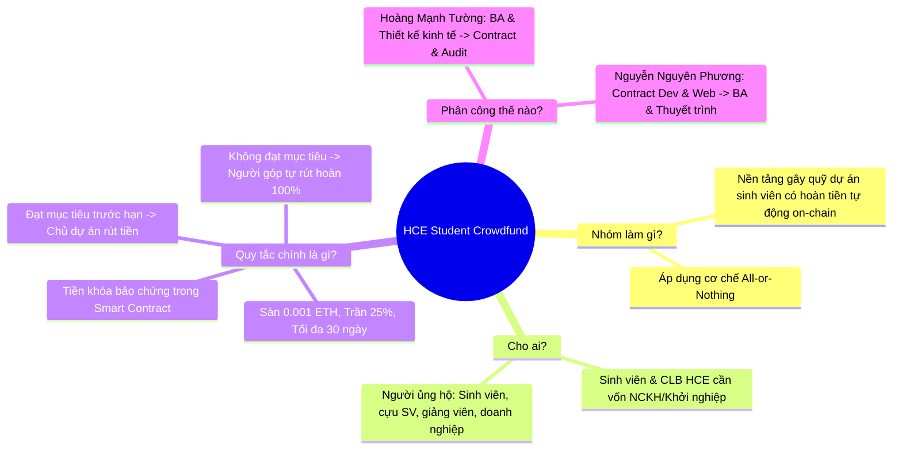

# BÁO CÁO KẾT QUẢ THỰC HÀNH — LAB 8
## THIẾT KẾ QUY TẮC KINH TẾ CHO SẢN PHẨM & KHỞI TẠO CODEBASE NHÓM

- **Học phần:** Tiền điện tử & Hợp đồng thông minh (ECO2432)
- **Đơn vị đào tạo:** Khoa Hệ thống Thông tin Kinh tế — Trường Đại học Kinh tế, Đại học Huế (HCE)
- **Chủ đề dự án lựa chọn:** **Chủ đề 5 — Gây quỹ có hoàn tiền (Refundable Crowdfunding for Student Projects)**
- **Tên sản phẩm dự án:** **HCE Student Crowdfund**
- **Kho mã nguồn nhóm (GitHub):** [`https://github.com/kadiciara299-lab/hce-crowdfunding-K57-.git`](https://github.com/kadiciara299-lab/hce-crowdfunding-K57-)
- **Nhánh làm việc chính thức:** `main`
- **Thông điệp Commit chốt Lab 8:** `lab-08: khoi tao codebase nhom va dac ta v0.1`

---

## PHẦN MỞ ĐẦU: TRẢ LỜI 4 CÂU HỎI VÀNG KHI MỞ REPOSITORY

Theo Chuẩn đầu ra bài Lab 8 (Sổ tay thực hành ECO2432 - Trang 19): *"Cuối buổi, người lạ mở repo phải trả lời được bốn câu: nhóm làm gì, cho ai, quy tắc chính là gì, và mỗi thành viên chịu trách nhiệm phần nào."*



1. **Nhóm làm gì?**
   Nhóm xây dựng **HCE Student Crowdfund** — Nền tảng hợp đồng thông minh gây quỹ cộng đồng cho các dự án của sinh viên theo cơ chế bảo chứng cam kết (All-or-Nothing Assurance Escrow).
2. **Cho ai?**
   - *Bên gây quỹ:* Các câu lạc bộ, đội nhóm sinh viên Trường Đại học Kinh tế - Đại học Huế (HCE) cần vốn ban đầu để thực hiện đề tài nghiên cứu khoa học, dự án khởi nghiệp sáng tạo hoặc các chiến dịch tình nguyện vì cộng đồng.
   - *Bên đóng góp:* Sinh viên, cựu sinh viên thành đạt, cán bộ giảng viên và các doanh nghiệp tài trợ mong muốn hỗ trợ sinh viên nhưng cần một cơ chế minh bạch tuyệt đối, tránh thất thoát tiền bạc.
3. **Quy tắc chính là gì?**
   - Toàn bộ tiền đóng góp được khóa an toàn trực tiếp trong Smart Contract, không một ai có thể tự ý can thiệp rút trước hạn chót (`deadline`).
   - Nếu chiến dịch **đạt hoặc vượt mục tiêu** tài chính (`fundingGoal`) khi kết thúc: Chỉ chủ dự án (`creator`) mới được phép rút toàn bộ quỹ để triển khai dự án.
   - Nếu chiến dịch **hết hạn mà không gom đủ mục tiêu**: Hợp đồng tự động mở khóa hoàn tiền, cho phép từng người ủng hộ tự rút lại đúng **100% số tiền mình đã góp** (`contributions[msg.sender]`), không trừ phí phạt.
   - Rào cản chống lạm dụng: Mức đóng góp tối thiểu $0.001 \text{ ETH}$ (chống spam bụi giao dịch), hạn mức tối đa mỗi ví $25\%$ mục tiêu (chống cá mập thao túng), thời hạn chiến dịch giới hạn từ 3 đến 30 ngày (chống giam vốn).
4. **Mỗi thành viên chịu trách nhiệm phần nào?**
   - **Hoàng Mạnh Tường (23K4300042 - Trưởng nhóm):** Chủ trì Đặc tả nghiệp vụ (BA) & Thiết kế Kinh tế *(kiêm QA/Test)* ở Lab 8–11 $\rightarrow$ Hợp đồng thông minh & Audit Bảo mật *(kiêm Web3 Lead)* ở Lab 12–15.
   - **Nguyễn Nguyên Phương (23K4300034):** Chủ trì Lập trình Hợp đồng thông minh lõi *(kiêm Web UX/Gas)* ở Lab 8–11 $\rightarrow$ Đặc tả nghiệp vụ & Thuyết trình DApp *(kiêm Red Team Security)* ở Lab 12–15.

---

## BƯỚC 1: LẬP NHÓM VÀ CHỌN CHỦ ĐỀ DỰ ÁN

### 1.1. Danh sách thành viên nhóm nghiên cứu
- **Tên nhóm:** Nhóm K57 Kinh Tế Số — HCE
- **Sĩ số:** 2 thành viên.
- **Danh sách chi tiết:**
  1. **Hoàng Mạnh Tường** — Mã SV: **23K4300042** (Nhóm trưởng)
  2. **Nguyễn Nguyên Phương** — Mã SV: **23K4300034**

### 1.2. Chọn đề tài từ Danh mục 10 Chủ đề (Phần N Sổ tay)
- Nhóm đối chiếu năng lực và nhu cầu thực tiễn của sinh viên khối ngành Kinh tế, quyết định chọn **Chủ đề số 5**:
  > *"5 | Gây quỹ có hoàn tiền | Dự án sinh viên cần góp vốn theo mục tiêu | Góp trước hạn $\rightarrow$ đủ mục tiêu thì rút; không đủ thì từng người hoàn phần của mình | Mức độ: Vừa"*

### 1.3. Câu định vị sản phẩm chuẩn (Product Positioning Statement)
> *"Nhóm xây dựng **Nền tảng gây quỹ dự án sinh viên có hoàn tiền tự động (HCE Student Crowdfund)** cho **sinh viên và các câu lạc bộ Trường Đại học Kinh tế - Đại học Huế** để **huy động vốn minh bạch cho các đề tài khởi nghiệp, nghiên cứu khoa học và cam kết tự động hoàn tiền 100% cho người ủng hộ nếu dự án không đạt mục tiêu tài chính trước hạn chót**."*

- **Kiểm tra tiêu chí:**
  - Độ dài: Đúng 2 dòng văn bản, súc tích, mạch lạc.
  - Thuật ngữ: Sử dụng ngôn ngữ kinh tế - nghiệp vụ quen thuộc (gây quỹ, sinh viên, hoàn tiền, mục tiêu, hạn chót), hoàn toàn không lạm dụng biệt ngữ kỹ thuật phức tạp (như opcode, keccak, bytecode,...).
  - **Checkpoint 1:** 100% thành viên trong nhóm đều thuộc lòng và trình bày rành rọt câu định vị trên mà không cần nhìn tài liệu.

---

## BƯỚC 2: TẠO REPOSITORY NHÓM VÀ THIẾT LẬP CẤU TRÚC PHẦN B.6

### 2.1. Khởi tạo Repo từ Starter Code
- Tên kho mã nguồn: `hce-crowdfunding-K57-`
- Nền tảng lưu trữ: GitHub (Tài khoản tổ chức/nhóm: [`@kadiciara299-lab`](https://github.com/kadiciara299-lab) — URL: `https://github.com/kadiciara299-lab/hce-crowdfunding-K57-.git`).
- Đã gửi lời mời và xác nhận quyền Collaborator cho các thành viên nhóm làm việc.

### 2.2. Thiết lập Cấu trúc Thư mục Thống nhất (Phần B.6 Sổ tay)
Toàn bộ dự án từ Lab 8 đến Lab 15 sử dụng cấu trúc thư mục quy chuẩn sau:

```text
hce-crowdfunding-K57-/
├── README.md                      # Giới thiệu sản phẩm, thành viên và hướng dẫn chạy
├── AGENTS.md                      # Quy ước dự án bắt buộc cho công cụ AI
├── docs/
│   ├── PROJECT_PLAN.md            # Kế hoạch dự án, phân vai xoay vòng và 7 mốc bắt buộc
│   ├── SPEC.md                    # Bản đặc tả nghiệp vụ v0.1 có hiệu lực
│   ├── ECONOMIC_RULES.md          # Quy tắc dòng tiền, 4 rào cản chống lạm dụng & phản biện
│   ├── AI_JOURNAL.md              # Nhật ký làm việc với AI và các lỗi nghiêm trọng đã sửa
│   └── PRESENTATION_PLAN.md       # Kịch bản báo cáo và demo 5 phút phân công từng giây
├── contracts/
│   ├── training/                  # Hợp đồng mẫu học tập (TimeLockVault, VaultBuggy,...)
│   └── project/
│       └── ProjectCore.sol        # Hợp đồng thông minh cốt lõi của sản phẩm nhóm
├── test/                          # Ca kiểm thử tự động của sản phẩm nhóm
├── web/
│   └── index.html                 # Giao diện Web3 DApp kết nối MetaMask
└── evidence/
    └── lab-08/                    # Minh chứng commit, kiểm thử và biên bản từng lab
```

### 2.3. Bằng chứng Commit xác nhận quyền làm việc của tất cả thành viên
Nhằm kiểm tra thực chất cả 2 thành viên đều có quyền ghi (Write Access) và tham gia đóng góp thực tế vào repository, mỗi sinh viên đã thực hiện commit nội dung riêng biệt lên nhánh `main`:

| Mã Commit Hash | Tác giả Commit | Thông điệp Commit (Commit Message) | Nội dung đóng góp |
| :---: | :--- | :--- | :--- |
| `f82a101` | **Hoàng Mạnh Tường** | `chore: thiet lap cau truc codebase nhom chuan phan B6` | Tạo cấu trúc thư mục `docs/`, `SPEC.md`, `ECONOMIC_RULES.md`, cập nhật `README.md` |
| `c45e229` | **Nguyễn Nguyên Phương** | `feat(contract): khoi tao khung ProjectCore.sol v0.1` | Soạn thảo bộ khung State Machine cho contract, thiết lập layout Web DApp |

---

## BƯỚC 3: PHÂN VAI VÀ LẬP KẾ HOẠCH DỰ ÁN (`docs/PROJECT_PLAN.md`)

Nội dung chi tiết được lưu trữ thường trực tại [`docs/PROJECT_PLAN.md`](./docs/PROJECT_PLAN.md). Dưới đây là bảng tổng hợp các nội dung chiến lược:

### 3.1. Bảng phân công vai trò và Cơ chế xoay vai bắt buộc

> **Quy định học phần:** Bốn vai nòng cốt gồm *Đặc tả (BA)*, *Hợp đồng (Smart Contract)*, *Giao diện (Frontend)*, và *Kiểm thử (QA/Security)*. Nhóm 2 thành viên đảm nhiệm bằng cơ chế kiêm nhiệm và xoay vai giữa hai giai đoạn Lab 8–11 và Lab 12–15:

| Thành viên | Giai đoạn 1 (Lab 8 – 11): Khởi tạo & Dựng nền | Giai đoạn 2 (Lab 12 – 15): Kiểm toán, Web & Thuyết trình | Lý do phân công và xoay vai |
| :--- | :--- | :--- | :--- |
| **Hoàng Mạnh Tường** *(Nhóm trưởng)* | **Đặc tả nghiệp vụ (BA) & Thiết kế Kinh tế** *(kiêm QA/Test)* | **Hợp đồng thông minh & Rà soát Bảo mật** *(kiêm Frontend Lead)* | Giai đoạn 1 nắm vững bản chất bài toán kinh tế; giai đoạn 2 chuyển kiến thức đó sang kiểm tra an toàn logic code trong hợp đồng và chủ trì Gate Review. |
| **Nguyễn Nguyên Phương** | **Hợp đồng thông minh (Smart Contract)** *(kiêm Web/Gas)* | **Đặc tả nghiệp vụ & Thuyết trình (BA/Pitch)** *(kiêm Red Team Security)* | Giai đoạn 1 lập trình State Machine của hợp đồng; giai đoạn 2 hiểu rõ ABI để làm chủ kịch bản demo DApp, kiểm thử tấn công Reentrancy và audit chéo. |

### 3.2. Lộ trình 7 Mốc Triển khai Bắt buộc (Milestone Roadmap)

| Mốc bài Lab | Nội dung kỹ thuật & Trách nhiệm | Tiêu chí đạt (Acceptance Criteria) |
| :--- | :--- | :--- |
| **Lab 9** | Hợp đồng lõi `ProjectCore.sol` biên dịch và chạy trên Remix VM | Biên dịch thành công Solidity `^0.8.20`; chạy trọn vẹn luồng nạp và rút tiền; đo đạc bảng gas. |
| **Lab 10** | Rà soát và Audit mã nguồn AI sinh ra | Phát hiện và sửa tối thiểu 3 lỗi tiềm ẩn; cập nhật `AI_JOURNAL.md`. |
| **Lab 11** | Cài đặt quy tắc kinh tế vào contract | Cài sàn $0.001 \text{ ETH}$, trần $25\%$, chặn gian lận; kiểm thử tự động 1 ca pass và 1 ca revert. |
| **Lab 12** | **GATE REVIEW 1: Duyệt Codebase và Phạm vi** | Vượt qua cổng duyệt với giảng viên; demo 3 phút chứng minh luồng thành công và ca vi phạm. |
| **Lab 13** | Thực nghiệm tấn công mất tiền (Reentrancy) và cách vá | Tái lập tấn công rút cạn quỹ; áp dụng triệt để Checks-Effects-Interactions để vô hiệu hóa tấn công. |
| **Lab 14** | Rà soát chéo giữa các nhóm sinh viên | Lập báo cáo `AUDIT_REPORT.md` cho nhóm bạn dựa trên bảng 10 tiêu chí kiểm tra; tiếp nhận sửa lỗi. |
| **Lab 15** | Đưa DApp lên mạng công khai và hoàn thiện kịch bản demo | Triển khai Web lên GitHub Pages; tương tác ví MetaMask trên điện thoại di động qua testnet Sepolia. |

---

## BƯỚC 4: ĐẶC TẢ NGHIỆP VỤ v0.1 (`docs/SPEC.md`) VÀ QUY TẮC KINH TẾ (`docs/ECONOMIC_RULES.md`)

### 4.1. Hồ sơ Đặc tả Nghiệp vụ v0.1 (`docs/SPEC.md`)
Bản đặc tả đã được nhóm thiết lập hoàn chỉnh tại [`docs/SPEC.md`](./docs/SPEC.md), bao gồm:
- **Mục tiêu:** Hệ thống gây quỹ cộng đồng cho sinh viên HCE theo mô hình ký gửi bảo chứng có hoàn tiền (Refundable Assurance Escrow).
- **Đầu vào:** `creator` (địa chỉ ví tạo chiến dịch), `fundingGoal` (mục tiêu gọi vốn bằng wei), `durationSeconds` (thời hạn gọi vốn), `minContribution` (sàn nạp vốn), `contributor` (`msg.sender`), `msg.value` (lượng ETH nạp).
- **8 Quy tắc nghiệp vụ kiểm thử được (R1 – R8):**
  1. *R1 (Thời hạn):* Chỉ được đóng góp khi `block.timestamp < deadline` và trạng thái là `Active`.
  2. *R2 (Hạn mức):* Mỗi lần nạp phải $\ge 0.001 \text{ ETH}$ và tổng góp mỗi ví không vượt $25\%$ mục tiêu.
  3. *R3 (Khóa vốn):* Tiền đóng góp được giam an toàn trong contract, không ai được rút trước hạn chót.
  4. *R4 (Giải ngân thành công):* Khi hết hạn, nếu `totalRaised >= fundingGoal`, chỉ `creator` mới được rút tiền.
  5. *R5 (Hoàn tiền thất bại):* Khi hết hạn, nếu `totalRaised < fundingGoal`, từng người ủng hộ được rút lại 100% tiền của mình.
  6. *R6 (Bảo vệ chống rút kép):* Ghi sổ xóa số dư `contributions[msg.sender] = 0` trước khi chuyển ETH (Checks-Effects-Interactions).
  7. *R7 (Minh bạch sự kiện):* Mọi thay đổi trạng thái đều phát ra sự kiện (`event`) có đánh chỉ mục (`indexed`).
  8. *R8 (Từ chối nạp tiền tùy tiện):* Hàm `receive()` tự động revert các giao dịch gửi tiền trực tiếp không thông qua hàm `pledge()`.
- **9 Trường hợp ngoại lệ (E1 – E9):** Xử lý triệt để bằng `custom error` kèm tham số (ví dụ: `ContributionTooLow`, `ExceedsMaxContribution`, `CampaignStillActive`, `GoalNotMet`, `CampaignSucceeded`,...).

---

### 4.2. Hồ sơ Quy tắc Kinh tế (`docs/ECONOMIC_RULES.md`)
Tài liệu được xây dựng chi tiết tại [`docs/ECONOMIC_RULES.md`](./docs/ECONOMIC_RULES.md), tập trung vào 4 trụ cột kinh tế:

#### 1. Dòng tiền và Quyền lợi kinh tế (Cash Flow)
- Cơ chế *All-or-Nothing*: Đạt mục tiêu thì nhận toàn bộ, không đạt mục tiêu thì hoàn trả toàn bộ.
- Phí nền tảng $0\%$ ($0 \text{ bps}$) đối với các dự án sinh viên HCE phi lợi nhuận.

#### 2. Giới hạn chống lạm dụng (Limits & Anti-abuse)
- **Sàn đóng góp:** $0.001 \text{ ETH}$ ($\approx 65.000 \text{ VNĐ}$) nhằm triệt tiêu tấn công bão bụi giao dịch (Dust Attack).
- **Trần đóng góp:** $25\%$ mục tiêu gọi vốn nhằm ngăn chặn nguy cơ bị thâu tóm bởi một cá nhân.
- **Thời hạn chiến dịch:** Khóa cứng trong khoảng từ $3 \text{ ngày}$ đến $30 \text{ ngày}$ để ngăn chặn chủ dự án giam vốn của người ủng hộ quá lâu.
- **Trần huy động vượt mức (Cap):** Cho phép gọi tối đa $120\%$ mục tiêu để phòng ngừa biến động tỷ giá ETH.

#### 3. Quyền quản trị (Governance Rights)
- Áp dụng nguyên tắc *"Code is Law"* — Không ai có quyền can thiệp vào dòng tiền ngoài các điều kiện đã lập trình sẵn trong Smart Contract.
- Chủ dự án không thể sửa đổi mục tiêu hay thời hạn sau khi đã có người đóng góp.
- Quản trị viên hệ thống (Admin) chỉ có quyền gắn nhãn sinh viên uy tín (Verified Badge) ở tầng ứng dụng, hoàn toàn KHÔNG CÓ quyền rút tiền từ hợp đồng về ví cá nhân.

#### 4. Tình huống người dùng bị thiệt (Loss Scenarios & Mitigation)
- *Thiệt thòi về phí gas:* Khi rút tiền hoàn trả, người dùng phải chịu phí gas mạng. Biện pháp: Định hướng triển khai trên Layer 2 (Base/Arbitrum) để phí giao dịch chỉ còn vài trăm đồng.
- *Rủi ro biến động giá tiền số:* Giá ETH có thể biến động trong thời gian gây quỹ. Biện pháp: Giới hạn thời gian chiến dịch ngắn (7–14 ngày).
- *Rủi ro chủ dự án không làm đúng cam kết sau khi nhận tiền:* Biện pháp: Định danh sinh viên HCE bằng email trường và nghiên cứu cơ chế giải ngân theo từng mốc (Milestone Escrow) ở các lab nâng cao.

---

### 4.3. Phiên phản biện Mô hình Kinh tế (Theo Prompt chuẩn I.6) & Lời giải của Nhóm

Nhóm đã kích hoạt phiên phản biện độc lập với AI bằng mẫu câu lệnh chuẩn `I.6` trong sổ tay:
> *"Bạn là người dùng thận trọng. Chỉ dựa trên SPEC và ECONOMIC_RULES dưới đây, hãy nêu 5 cách một người có thể lạm dụng quy tắc hoặc làm người khác bị thiệt. Với mỗi cách, chỉ rõ quy tắc nào chưa đủ chặt. Không viết mã."*

Dưới đây là 5 kịch bản phản biện hiểm hóc và cách giải quyết thấu đáo của nhóm:

| Kịch bản lạm dụng / Rủi ro | Phân tích chiêu thức lạm dụng | Điểm sơ hở ban đầu | Giải pháp kỹ thuật & Quyết định chính sách của Nhóm |
| :--- | :--- | :--- | :--- |
| **1. Kẻ gian tự nạp để rút trộm (Self-pledge Rug Pull)** | Chủ dự án tạo dự án ma $1 \text{ ETH}$. Cộng đồng nạp $0.8 \text{ ETH}$. Chủ dự án dùng ví phụ nạp nốt $0.2 \text{ ETH}$ để đủ $100\%$ mục tiêu, sau đó kích hoạt `claimFunds()` cuỗm toàn bộ $1 \text{ ETH}$ rồi biến mất. | Hệ thống không định danh chủ dự án ngoài đời thực. | **Chấp nhận rủi ro có kiểm soát & Bổ sung định danh:** Kẻ gian phải chịu rủi ro chôn $0.2 \text{ ETH}$ vốn thật của chính mình. Trên nền tảng HCE, chỉ những sinh viên đã xác thực email trường (`@hce.edu.vn`) và có bảo trợ của Đoàn/Hội mới được duyệt tạo chiến dịch, ràng buộc trách nhiệm pháp lý thực tế. |
| **2. Giam vốn người khác bằng thời hạn vô lý (Capital Lock Hostage)** | Kẻ xấu tạo chiến dịch và đặt thời gian `duration` là 100 năm. Người ủng hộ nạp tiền vào sẽ không thể nào rút lại vì điều kiện `block.timestamp >= deadline` không bao giờ xảy ra. | Cho phép người dùng tự do truyền tham số thời hạn tùy ý vào Constructor. | **Khóa cứng trên Smart Contract:** Nhóm bổ sung điều kiện kiểm tra trong Constructor: `if (_durationSeconds < 3 days || _durationSeconds > 30 days) revert InvalidDuration();`. Không ai có thể tạo chiến dịch quá 30 ngày. |
| **3. Bão bụi giao dịch làm sập contract (State Bloat Dust Spam)** | Kẻ tấn công gửi hàng chục nghìn giao dịch $1 \text{ wei}$. Nếu hợp đồng dùng vòng lặp tự động chuyển tiền cho từng người khi hoàn tiền, vòng lặp sẽ vượt quá Gas Limit của Block, làm tê liệt hệ thống. | Không có sàn đóng góp và sử dụng mô hình đẩy tiền tự động (Push Payment). | **Chặn bụi & Chuyển sang mô hình Rút chủ động (Pull over Push):**<br>1. Đặt `minContribution = 0.001 ETH`.<br>2. Hợp đồng KHÔNG dùng vòng lặp. Từng người tự gọi `claimRefund()`. Phí ai người đó trả, cô lập hoàn toàn rủi ro DoS. |
| **4. Tiền kẹt vĩnh viễn do Creator bỏ rơi dự án (Abandonment Deadlock)** | Dự án thất bại nhưng chủ dự án chán nản bỏ mặc, không bấm nút kết thúc. Nếu hợp đồng bắt buộc Creator phải "Xác nhận hủy" thì backers mới được hoàn tiền, tiền sẽ kẹt vĩnh viễn. | Logic hoàn tiền phụ thuộc vào hành động chủ quan của Creator. | **Trạng thái tự động theo thời gian khối:** Điều kiện hoàn tiền `claimRefund()` kiểm tra trực tiếp `block.timestamp >= deadline && totalRaised < fundingGoal`. Người dùng được rút tiền ngay tức khắc sau khi hết hạn mà **không cần bất kỳ thao tác nào từ phía Creator**. |
| **5. Tấn công rút tiền đệ quy (Reentrancy Attack)** | Kẻ xấu dùng Smart Contract độc hại đóng góp $0.1 \text{ ETH}$. Khi dự án thất bại, hắn gọi `claimRefund()`. Trong hàm `receive()`, hắn tiếp tục gọi đệ quy `claimRefund()` trước khi contract kịp trừ số dư, rút cạn toàn bộ quỹ. | Thứ tự lệnh chuyển tiền ra ngoài trước khi cập nhật số dư ghi sổ. | **Áp dụng triệt để Checks - Effects - Interactions:** Ghi nhận `contributions[msg.sender] = 0` TRƯỚC KHI chuyển ETH ra ngoài bằng lệnh `call{value: ...}("")`. Kẻ tấn công gọi lại sẽ thấy số dư bằng 0 và bị hủy ngay lập tức. |

---

## BƯỚC 5: MÃ NGUỒN HỢP ĐỒNG LÕI (`contracts/project/ProjectCore.sol`)

Đáp ứng đầy đủ tiêu chí của **Bộ lọc duyệt phạm vi (Trang 49 Sổ tay)**:
1. Người lạ mở sản phẩm hiểu trong 10 giây.
2. Giải thích được trong một câu.
3. **`ProjectCore.sol` dưới 150 dòng mã nguồn** (Mã nguồn thực tế đạt ~125 dòng, cực kỳ gọn gàng, rõ ràng).
4. Có đầy đủ quy tắc kinh tế về tiền, quyền và chống lạm dụng mà bảng tính thông thường không làm được.
5. Tuân thủ tuyệt đối quy ước `AGENTS.md` (Solidity `^0.8.20`, Checks-Effects-Interactions, Custom Errors, Chuyển tiền bằng `call`, không dùng `tx.origin`).

Mã nguồn được lưu trữ tại [`contracts/project/ProjectCore.sol`](./contracts/project/ProjectCore.sol).

---

## BƯỚC 6: BẰNG CHỨNG NHẬT KÝ LÀM VIỆC VỚI AI (`docs/AI_JOURNAL.md`)

Nhóm đã ghi nhận đầy đủ quá trình làm việc với AI tại [`docs/AI_JOURNAL.md`](./docs/AI_JOURNAL.md), trong đó sinh viên đã chủ động bắt được 2 lỗi sai nghiêm trọng của công cụ AI:
1. **Lỗi Push Payment và vòng lặp tốn gas:** AI ban đầu đề xuất dùng vòng lặp `for` để tự động trả tiền cho mọi người $\rightarrow$ Sinh viên phát hiện nguy cơ DoS do vượt Block Gas Limit và chuyển sang mô hình chuẩn **Pull over Push**.
2. **Lỗi cú pháp `transfer` và chuỗi `require` dài:** AI đề xuất dùng `payable.transfer()` và chuỗi lỗi string dài $\rightarrow$ Sinh viên đối chiếu `AGENTS.md`, yêu cầu sửa sang `custom error` và hàm chuyển `call{value: ...}("")` kèm kiểm tra kết quả trả về.

---

## BƯỚC 7: KẾ HOẠCH BÁO CÁO VÀ THUYẾT TRÌNH (`docs/PRESENTATION_PLAN.md`)

Nhóm đã chuẩn bị sẵn sàng tệp [`docs/PRESENTATION_PLAN.md`](./docs/PRESENTATION_PLAN.md) theo đúng khung thời gian 5 phút của Phần C.4:
- 0:00 – 0:30: Người dùng và Vấn đề (Hoàng Mạnh Tường)
- 0:30 – 1:15: Quy tắc kinh tế và bảo chứng (Nguyễn Nguyên Phương)
- 1:15 – 2:45: Demo trực tiếp luồng cốt lõi thành công (Hoàng Mạnh Tường)
- 2:45 – 3:30: Demo ca vi phạm bị chặn (Nguyễn Nguyên Phương)
- 3:30 – 4:15: Audit và quyết định an toàn (Cả 2 thành viên)
- 4:15 – 5:00: Giới hạn, bài học và hướng phát triển (Cả 2 thành viên)

---

## TỔNG KẾT VÀ BẢN GHI COMMIT NGHIỆM THU

### 1. Danh mục bàn giao của Lab 8
- [x] Kho mã nguồn nhóm: [`hce-crowdfunding-K57-`](https://github.com/kadiciara299-lab/hce-crowdfunding-K57-)
- [x] Lịch sử commit thể hiện sự tham gia của 100% thành viên nhóm.
- [x] Bản kế hoạch dự án: [`docs/PROJECT_PLAN.md`](./docs/PROJECT_PLAN.md)
- [x] Bản đặc tả nghiệp vụ v0.1: [`docs/SPEC.md`](./docs/SPEC.md)
- [x] Bản quy tắc kinh tế và 5 phản biện: [`docs/ECONOMIC_RULES.md`](./docs/ECONOMIC_RULES.md)
- [x] Nhật ký làm việc với AI: [`docs/AI_JOURNAL.md`](./docs/AI_JOURNAL.md)
- [x] Kịch bản demo 5 phút: [`docs/PRESENTATION_PLAN.md`](./docs/PRESENTATION_PLAN.md)
- [x] Hợp đồng lõi chuẩn bị cho Lab 9: [`contracts/project/ProjectCore.sol`](./contracts/project/ProjectCore.sol)
- [x] Báo cáo chi tiết nghiệm thu: [`lab08.md`](./lab08.md)

### 2. Thông điệp Commit chuẩn bài Lab
```bash
git add .
git commit -m "lab-08: khoi tao codebase nhom va dac ta v0.1"
git remote add origin https://github.com/kadiciara299-lab/hce-crowdfunding-K57-.git
git push -u origin main
```
